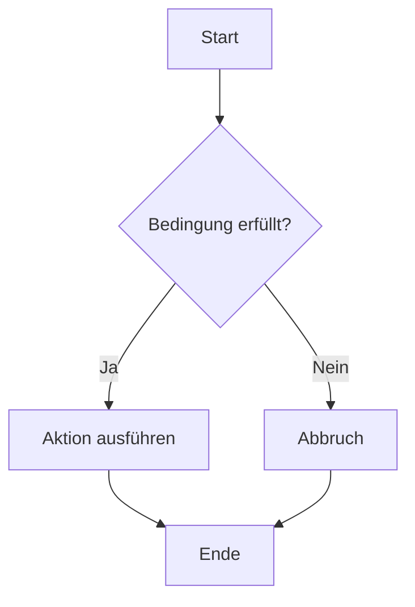

# GitHub Workshop

Lorem ipsum

[🐞 Bug melden](https://github.com/GregorBiswanger/t801-hello-github/issues/new?template=bug_report.md&label=bug&title=Fehler%20gefunden)

```javascript
console.log('Hello World');
```


